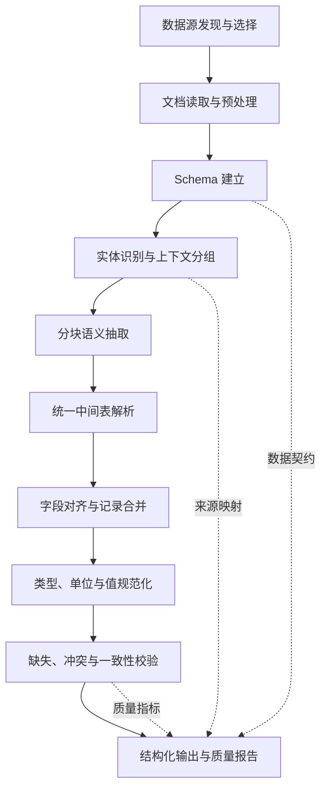

# 非结构化文档 ETL 方案设计

## 1. 文档目的

本文定义一套将非结构化或半结构化文档转换为结构化数据的通用 ETL 方案。它关注稳定的设计理念、处理边界和数据契约，不依赖特定代码仓库、模型、框架或部署环境。

方案适用于 Markdown、纯文本和可提取文本的 PDF 等资料。典型输入是一批以自然语言描述实体、事件或指标的文档，典型输出是一组可供查询、关联和计算的结构化表。

## 2. 设计目标

系统需要满足以下目标：

- 从长文档中识别实体、字段及实体之间的记录边界。
- 将同一实体散落在不同段落或页面的信息合并为一条记录。
- 在保留业务含义的前提下统一字段名称、类型、单位和空值表达。
- 将语义判断与确定性数据处理分离，使结果可检查、可复现、可迭代。
- 对局部失败进行隔离，允许已成功处理的数据继续交付。
- 提供足够的过程指标和诊断信息，支持质量评估与问题定位。

本方案不负责回答业务问题，也不负责完成跨表聚合、统计分析或推理。ETL 的职责止于生成带有明确数据契约的结构化数据。

## 3. 核心设计原则

### 3.1 Schema 先行

抽取开始前先建立目标 Schema，包括字段名称、业务定义、数据类型、身份字段和单位。Schema 决定系统要抽取什么，并为后续清洗和验证提供约束。

当存在数据字典或治理说明时，以其为基础，并允许从正文补充未覆盖字段；当不存在治理信息时，通过跨章节采样推断候选 Schema，再合并多次推断结果，降低单次语义判断带来的字段遗漏。

### 3.2 以实体为处理单元

长文档不能只按固定长度切分。系统应先识别记录标识和实体边界，把属于同一实体的上下文聚合在一起，再按处理预算打包。这样可以减少跨块信息丢失、实体串行和重复记录。

### 3.3 语义抽取与确定性处理分层

语义模型用于理解字段含义、识别实体归属和提取候选值；程序逻辑负责解析、类型检查、冲突处理、记录合并、单位管理和结果序列化。

模型输出应采用简单、受约束的中间格式，而不应直接作为最终表交付。所有候选记录都必须进入统一的内存数据模型，再经过确定性规则处理。

### 3.4 保守修复

系统只有在证据充分且结果唯一时才自动修复。无法确认的冲突应保留诊断信息，而不是静默覆盖；无法安全挂接到实体的片段应隔离处理，而不是强行归并。

### 3.5 数据与元数据共同交付

字段单位、换算规则、Schema 版本、来源和质量指标都是数据契约的一部分。结构化表不能脱离这些元数据单独解释。

## 4. 总体架构



各阶段通过显式数据契约连接。下游阶段不得依赖上游模型响应的自由文本细节，而应依赖标准化的中间对象。

## 5. 输入与输出契约

### 5.1 输入

输入由三类信息组成：

1. 待处理文档，包括文档标识、内容、格式和可选的版本信息。
2. 可选的数据治理信息，包括字段定义、表定义、主键、类型和单位。
3. 可选的任务上下文，用于判断哪些文档和字段与当前数据需求相关。

文档选择应遵循按需原则，只处理与目标数据需求相关的来源。若治理信息引用了某个尚无结构化来源的实体集合，系统应将可能承载该集合的文档纳入候选。

### 5.2 中间数据模型

统一中间表至少包含以下结构：

```text
EntityTable
  schema             字段定义及顺序
  primary_key        主身份字段
  anchor_keys        辅助身份字段
  records            候选实体记录
  rejects            无法解析的输入片段
  conflicts          字段或身份冲突
  metrics            各阶段质量指标

Record
  identity           实体身份
  fields             标准字段及候选值
  provenance         字段值的来源和写入阶段
  confidence         可选的证据强度
  flags              近似值、缺失值、冲突等标记
```

所有后处理阶段直接修改或派生这一数据模型。中间结果可以输出用于诊断，但不能通过反复序列化和重新解析来驱动主流程。

### 5.3 输出

最终交付物包括：

- 一张或多张结构化表。
- Schema 和字段业务定义。
- 字段单位及必要的换算规则。
- 表级和字段级质量指标。
- 拒绝记录、未解决冲突和部分成功状态。
- 可用于追踪问题的来源信息与阶段日志。

输出表应使用标准格式序列化，并通过原子写入发布，避免下游读取到不完整文件。

## 6. 处理流程

### 6.1 数据源发现与选择

系统首先建立数据源清单，识别文档格式、大小、主题、可能包含的实体和已有结构化来源。根据目标 Schema 或数据需求选择必要文档，避免对无关资料进行昂贵抽取。

选择结果必须可解释，至少记录数据源被选中或排除的原因。自动选择无法作出可靠判断时，应优先扩大候选范围，但仍需保留资源预算上限。

### 6.2 文档读取与预处理

不同格式在进入抽取流程前应转换为统一的段落表示：

- 保留标题、列表、表格、页码等结构信息。
- 合并由排版造成的软换行。
- 修复跨页但语义连续的段落。
- 为段落分配稳定编号，作为分组和溯源的公共坐标。

文本提取与 OCR 是两个独立能力。系统应明确输入是否包含可提取文本；图片型文档若无 OCR 能力，应报告不支持或低覆盖，而不能将空文本视为无数据。

### 6.3 Schema 建立

Schema 由以下信息组成：

| 要素 | 说明 |
| --- | --- |
| 字段名 | 最终输出使用的规范名称 |
| 字段定义 | 字段的业务含义及与相似字段的区别 |
| 字段类型 | 字符串、数值、布尔、日期等 |
| 身份字段 | 主键和辅助身份锚点 |
| 单位 | 来源单位、目标单位和换算规则 |
| 可空性 | 字段是否允许缺失 |

治理 Schema 与正文推断 Schema 合并时，应以治理定义作为字段语义基准，以正文发现作为覆盖补充。同义字段需要语义裁决；名称相似但业务含义不同的字段必须保留为独立字段。

若无法建立具备身份字段和有效业务字段的 Schema，本次抽取应停止，并将文档交由其他读取方式处理。

### 6.4 实体识别与上下文分组

系统使用记录编号、业务代码、名称或其他重复身份特征识别实体。语义模型可以提出段落分组，但分组结果必须经过确定性检查：

- 每个段落索引必须有效。
- 每个实体分组至少有一个可验证的身份锚点。
- 同一段落属于多个实体时，原文必须同时支持这些实体。
- 明确提及其他实体的段落不能被当前实体独占。
- 原文中带有身份标识但被遗漏的段落应被补回。

无法可靠分组时，系统可回退到按章节或位置分块。回退会降低实体完整性，因此必须在质量报告中显式标记。

### 6.5 分块语义抽取

同一实体的完整上下文应尽量放入同一处理块，并在块内注入明确的实体标记。多个小实体可以按 token 或字符预算合并处理，超大实体则单独处理。

抽取提示应包含：

- 目标 Schema 和字段定义。
- 身份字段及其使用规则。
- 数据类型和单位要求。
- 空值、近似值和禁止推断规则。
- 简单且可解析的输出格式。

抽取完成后，系统比较预期实体与实际实体。整块失败或实体遗漏时，只对缺失实体进行定向重试，避免重复处理全部文档。

### 6.6 解析与字段对齐

模型输出首先经过严格解析。无法形成合法键值记录的内容进入拒绝集合，并可在有限次数内执行格式修复。

解析后的未知字段先保留，再根据字段定义判断其属于：

- 规范字段的拼写或大小写变体。
- 规范字段的语义同义词。
- 具有独立含义的新字段。
- 无效字段或模型解释内容。

字段对齐必须同时考虑名称、定义和值分布。只依赖字符串相似度容易错误合并业务含义不同的字段。

### 6.7 实体合并

同一实体可能产生多条记录。合并顺序如下：

1. 使用主键聚合明确匹配的记录。
2. 使用辅助身份字段挂接缺少主键的片段。
3. 检查多个身份字段是否相互冲突。
4. 以有效值补充空值。
5. 对两个不同的有效值记录冲突，不静默覆盖。

只有当辅助身份字段唯一指向目标实体时，缺主键片段才可自动归并。无法安全归并但含有效数据的片段应保留为待处理记录；只有确认不含业务数据的回声或噪声片段才可删除。

### 6.8 类型与单位规范化

类型规范化应采用轻量且可解释的规则：

- 统一空值和布尔值表达。
- 去除数值中的展示符号，同时保留原始单位信息。
- 标准化日期格式。
- 拒绝与字段类型明显不符的叙述性内容。
- 保留近似值标记，直到一致性修复结束。

单位换算必须作为显式契约处理。每个字段应区分来源单位、目标单位和换算因子。确定性换算优先于语义推断；无法确认单位时不得默认换算。

比例字段需要区分小数比例与百分数表示，并参考同一数据域已有结构化来源的存储约定。单位元数据应与表同时交付，防止下游重复换算或数量级误读。

### 6.9 缺失、冲突与一致性校验

质量修复采用分层策略：

1. 检查同一实体不同字段间的可疑重复值。
2. 对高覆盖字段中的局部缺失进行定向补抽。
3. 抽样或按风险选择记录，与原文重新核对字段值。
4. 利用数据中稳定成立的业务恒等式修复唯一可解的近似值或单项缺失。

自动修复必须满足证据唯一性。例如，利用 `A = B + C` 修复数值时，应先验证该关系在足够多记录中稳定成立；如果多个关系给出不同候选值，或一条记录缺少多个关系项，则不执行修复。

校验阶段应明确区分“已检查”“已修复”和“仍未确认”。抽样核验不能被描述为全量验证。

### 6.10 输出与发布

输出前执行结构校验：

- 表头不能为空且字段名唯一。
- 每行列数与 Schema 一致。
- 至少存在一条包含有效业务值的记录。
- 字符编码和序列化格式有效。
- 必需的单位及 Schema 元数据可访问。

发布采用临时文件写入后原子替换的方式。只有结构校验通过的产物才能进入可消费目录；校验失败的产物保留为诊断材料，不应暴露给下游分析。

## 7. 可靠性设计

### 7.1 局部失败隔离

文档之间相互隔离。单个文档失败时，其他成功文档仍可交付，并将整体状态标记为部分成功。文档内部的分块失败同样不应抹去已成功抽取的块，但必须报告覆盖缺口。

### 7.2 有界重试

格式修复、实体补抽和字段补抽均需设置次数、并发量和时间上限。重试应针对明确失败单元，避免整批重复调用。

### 7.3 缓存有效性

缓存键至少应包含：

- 文档内容指纹。
- Schema 或治理规则版本。
- 抽取策略版本。
- 影响结果的模型及参数版本。

缓存命中前仍需执行结构校验。仅以文件名或任务编号作为缓存键不足以判断结果是否仍然有效。

### 7.4 记录守恒

每个阶段记录实体数、非空单元格数、拒绝数和冲突数。记录数或有效值数量异常下降时触发告警，并说明变化来自正常合并、噪声删除还是潜在数据丢失。

记录守恒是诊断机制，不是要求所有阶段记录数保持不变。合法的实体合并会减少记录数，定向补抽也可能增加记录数或有效值数量。

## 8. 可观测性与质量指标

建议至少记录以下指标：

| 维度 | 指标示例 |
| --- | --- |
| 输入 | 文档数、页数、段落数、字符数 |
| Schema | 字段数、治理字段覆盖率、推断字段数 |
| 分组 | 识别实体数、未分组段落数、回退次数 |
| 抽取 | 块数、成功率、重试数、遗漏实体数 |
| 解析 | 有效记录数、拒绝行数、未知字段数 |
| 合并 | 合并前后记录数、身份冲突数、字段冲突数 |
| 质量 | 字段填充率、修复数、未解决冲突数 |
| 性能 | 各阶段耗时、调用次数、输入输出 token 或字符数 |

每个字段值应尽可能保留来源文档、段落编号和最后修改阶段。若无法提供字符级证据，也应保留到实体上下文级别的来源映射。

## 9. 安全与治理要求

- 不从原文不存在的信息推断事实值。
- 不把模型分析过程写入业务字段。
- 不因字段为空而自动填充零或默认值。
- 不因名称相似而自动合并字段或实体。
- 不因输出结构合法而宣称语义正确。
- 对敏感字段遵循最小采集原则，仅抽取下游明确需要的数据。
- 保留 Schema、规则和模型版本，确保结果可追溯。

## 10. 验收标准

方案实现应至少通过以下类型的验收：

1. **Schema 覆盖**：治理字段不会因模型遗漏而消失，正文新增字段可被发现并审查。
2. **实体完整性**：跨段落、跨页面的同一实体能正确合并，不同实体不会因局部编号相似而串行。
3. **冲突保留**：两个有效但不同的候选值不会被静默覆盖。
4. **类型与单位正确性**：数值、日期、布尔和比例表达符合数据契约，换算行为可追踪。
5. **缺失值安全性**：无法唯一确定的缺失值保持为空，不执行猜测性填充。
6. **失败隔离**：单文档或单分块失败不影响其他有效产物交付。
7. **缓存正确性**：输入内容或关键配置变化后不会复用过期结果。
8. **输出原子性**：下游只能看到完整且通过结构校验的产物。
9. **可追溯性**：关键值、修复和冲突可定位到来源及处理阶段。

## 11. 方案边界

本方案依赖输入文档能够被转换为文本。扫描件、图表、复杂表格或视频内容需要独立的 OCR、视觉理解或多模态解析能力。

语义模型可以提升字段理解和长文本抽取能力，但不能替代数据约束与质量验证。最终结果的可靠性取决于 Schema 质量、实体身份是否稳定、来源文本是否完整，以及领域规则是否充分。

对于缺乏稳定身份字段、字段定义高度歧义或要求逐字证据的数据，应降低自动化程度，并将不确定记录送入人工复核流程。
