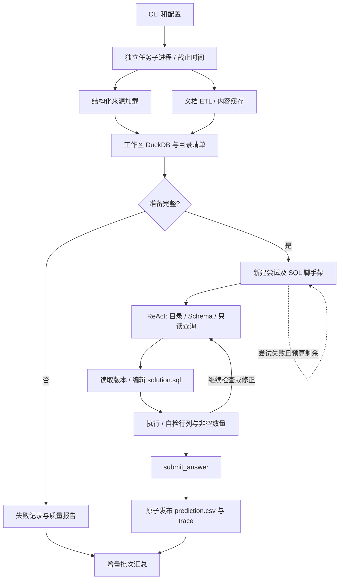

# 项目结构与运行机制

> 更新日期：2026-09-22。本文件描述当前实现；改造前行为见 [基线快照](project_baseline.md)，设计目标见 [ReAct 方案](react.md) 和 [ETL 方案](etl_design.md)。开发状态见 [progress.md](progress.md)。

## 1. 目标与边界

项目从本地 `public/input/task_<id>/` 读取问题和数据，将 CSV、JSON、SQLite 与文档抽取表统一物化到 DuckDB，再通过受控 ReAct 循环生成并执行 SQL，输出 `prediction.csv`。

求解链路不读取 `public/output`。标准答案仅由独立的 `dabench evaluate` 使用。运行成功表示当前程序生成了结构合法的结果，答案是否正确需单独评估。

## 2. 模块分工

| 模块 | 核心职责 |
| --- | --- |
| `cli.py` | 状态查看、任务检查、单任务、批量运行和独立评分入口 |
| `config.py` | 数据、模型、ETL、运行配置；环境变量密钥引用与配置边界检查 |
| `benchmark/dataset.py`、`schema.py` | 任务发现与元信息校验、任务/答案契约 |
| `benchmark/evaluate.py` | 独立 CSV 结果比较，不进入模型上下文 |
| `data/catalog.py` | 来源指纹、CSV/JSON/SQLite 加载、命名冲突处理、目录清单 |
| `data/query.py` | 只读 DuckDB 查询、查询截止时间、SQL 版本编辑、执行与产物校验 |
| `etl/documents.py` | 文本/PDF 段落编号、身份线索、分块和跨全文 Schema 采样 |
| `etl/schema.py` | 字段类型、单位、复合主键与确定性规范化 |
| `etl/pipeline.py` | Schema 规划、并发抽取、证据验证、主键合并、拒绝/冲突/失败块与缓存 |
| `agents/model.py` | OpenAI 兼容适配器、请求超时和 SDK 重试、共享请求预算和用量记录 |
| `agents/react.py`、`runtime.py` | 逐轮动作/观察、旧历史折叠、模型失败结果和步骤耗时 |
| `tools/analysis.py` | 正式求解工具注册表与提示：目录、探查、程序编辑、执行、提交 |
| `run/runner.py` | 准备阶段、完整尝试、任务子进程截止时间、批量调度和汇总 |
| `storage.py` | 原子文件发布与追加式事件日志 |
| `scripts/validate_inputs.py` | 无模型的真实输入兼容性与加载性能验证 |
| `tests/` | 数据层、ETL、运行器、配置、评分的离线回归 |

原 `tools/filesystem.py`、`sqlite.py`、`python_exec.py` 和基线工具注册表仍保留用于兼容与显式测试注入。正式 CLI 的求解工具不暴露任意 Python 或模型手写答案表。

## 3. 运行时链路



### 3.1 数据准备

- 默认数据根目录为 `public/input`；`dataset.task_ids` 可选择任务，`--limit` 限制数量。
- CSV 由 DuckDB 加载；JSON 支持对象数组和 `{records: [...]}` 包装，先通过 ijson 流式转为逐行 JSON，避免为大型包装对象分配超大缓冲。
- SQLite 通过标准库只读连接分批导入，不依赖联网安装扩展。所有来源在模型查询前物化，查询阶段不再需要原始文件访问权限。
- 表名从来源名/原表名生成，重名附加稳定来源散列；字段名保留，含空格的列使用双引号。
- `knowledge.md` 作为治理说明，不作为业务记录抽取。其他 Markdown、TXT、文本 PDF 进入 ETL；扫描件 PDF 不支持 OCR。
- 任一结构化来源加载失败则准备失败。ETL 默认要求全部文档为 `complete`；显式 `etl.allow_partial=true` 才允许带质量缺口继续，目录中仍保留质量状态。

### 3.2 文档 ETL

1. 读取全文并分配稳定段落编号；PDF 同时保留页码。
2. 综合问题、治理说明、关联表和跨全文样本建立字段/单位/复合主键契约。
3. 根据 Schema 给出的身份标签识别编号，聚合同一实体的段落，再按字符预算装箱。复杂多实体段落保留独立来源，大实体必要时跨块。
4. 每块请求结构化记录和逐字段引用，有限并发执行。检查段落覆盖、字段契约、主键、引用真实存在性及可确定的实体遗漏，失败块按配置重试。
5. 按完整主键合并记录，以非空值补充空值。不同有效候选值形成冲突，争议字段置空并保留所有证据；缺主键记录隔离，禁止猜测挂接。
6. 输出记录、Schema、来源、拒绝、冲突、失败块、非空数量和耗时。只有完整结果进入缓存，缓存读取再次校验字段、类型和主键。

缓存键包括文档内容、问题、治理说明、结构化目录、模型标识与温度、抽取提示、策略版本和块预算。缓存文件原子写入，损坏或不完整时重新抽取。

当前 `complete` 是程序检查结果，不是语义正确性证明。引用存在不能证明模型理解正确；无明确编号的实体覆盖、低频字段遗漏和跨块更正仍需真实模型评估。

### 3.3 ReAct 与程序交付

正式工具包括：`list_tables`、`inspect_table`、`query`、`read_knowledge`、`read_document`、`read_solution`、`edit_solution`、`run_solution`、`submit_answer`。

模型通过自定义 JSON 动作协议每轮选择一个工具。任务与治理说明常驻上下文；近期完整动作/观察按字符预算保留，较早历史折叠后可重新查询。该预算用于限制历史，不是严格 token 上限。

求解程序是每次尝试独立的 `solution.sql`，只允许一条 SELECT/WITH 查询。编辑必须提供读取时的内容散列版本，提交前进行语法检查，旧版本编辑被拒绝。编辑或执行失败使之前结果失效。

探查与最终执行使用同一个只读数据库和 DuckDB 方言。探查最多返回 200 行，并截断长字符串；最终结果不使用预览截断，超过配置行数上限则明确失败。执行后返回行列、非空计数、样本和耗时。`submit_answer` 不接受答案值，只提交当前程序最新一次成功执行的结果。

### 3.4 并发与超时

批量运行使用线程池调度独立任务子进程，串行批跑也走相同进程包装。显式设置任务超时 `<=0` 时关闭进程包装。注入自定义模型/工具的 Python 调试接口在当前进程执行，不提供强制任务截止时间。

| 层次 | 约束 |
| --- | --- |
| 批次 | `run.max_workers` 限制同时执行的任务数量 |
| 任务 | `run.task_timeout_seconds` 覆盖准备、ETL 和全部尝试；超时终止任务进程，POSIX 下清理其进程组 |
| ETL | 每个任务 `etl.max_workers` 个抽取请求；总请求并发可能达到任务并发 × ETL 并发 |
| 模型 | 单请求超时与 SDK 重试次数；ETL 与 ReAct 共用逻辑请求预算 |
| SQL | 使用计时器调用 DuckDB interrupt；设置线程和内存上限 |
| 结果 | `max_result_rows` 防止无界结果交付，不静默截断 |

任务进程使用原子结果文件返回父进程，避免等待进程退出后读取大队列造成阻塞。正常产物写入在任务核心执行之后，不计入进程核心截止时间。

## 4. 失败与重试

| 失败 | 处理方式 | 记录 |
| --- | --- | --- |
| 缺少 API key | 准备前失败，不反复加载大数据 | `configuration_error` 与任务事件 |
| 来源加载错误 / 严格 ETL 质量未通过 | 阻止发布不完整答案 | `preparation_error`、目录错误、ETL 报告 |
| ETL 格式、证据或覆盖错误 | 只重试失败块，不重跑成功块 | 每次原始响应与校验错误 |
| ReAct 解析 / 工具错误 | 当前尝试下一轮修正，消耗步数 | 原始响应、动作与参数、错误类型 |
| 模型调用失败 | SDK 有界重试后结束当前尝试；预算允许则新尝试 | 已有步骤保留，`model_error` |
| 步数耗尽 | 新建独立尝试，从干净 SQL 脚手架开始 | `steps_exhausted` 与各尝试 trace |
| SQL 错误 / 超时 / 非有限数值 / 结果过大 | 拒绝旧产物，返回观察给模型修正 | 工具错误与执行耗时 |
| 任务超时 | 终止进程，读取最后步骤快照 | `task_timeout`；ETL 期间也保留已写事件 |
| 一个任务元数据损坏 | 转为失败任务，继续批次 | 单任务失败 trace、增量 summary |

本次未实现自动降级答案、无证据的数值修复、完整任务断点续跑。重试目录隔离防止旧结果污染；已成功的 ETL 结果可以通过内容缓存复用。磁盘不可写等基础设施故障仍可能阻止产物或汇总保存。

## 5. 可观测性

```text
artifacts/runs/<run_id>/
├── summary.json
└── task_<id>/
    ├── events.jsonl              # 请求、响应、用量、阶段、步骤，逐条追加
    ├── workspace/
    │   ├── data.duckdb           # 已物化输入，仅供模型只读查询
    │   └── catalog.json          # 来源指纹、列、行数、错误、ETL 状态
    ├── etl/<index>_<name>.json   # Schema、记录、引用、拒绝、冲突、指标
    ├── attempts/<n>/
    │   ├── solution.sql
    │   ├── result.csv            # 本尝试当前成功执行的结果
    │   └── trace.json            # 步骤增量快照及尝试最终状态
    ├── trace.json                # 任务结果、最后尝试步骤、各尝试索引、用量、总耗时
    └── prediction.csv           # 仅正式提交成功后发布
```

- 模型事件保存请求消息、响应、逻辑调用编号、输入/输出/总 token 和 SDK 返回的用量明细。模型没有返回用量时统计为空/零，不推测成本。
- 步骤记录包含模型耗时、工具耗时、动作、观察和错误。任务 trace 包含 `failure_code`、`failure_reason`、`model_calls`、`usage` 和 `e2e_elapsed_seconds`。
- ETL 保存原始/合并记录数、非空单元格数、块数、段落数、无身份锚点段落数及阶段耗时。
- 批次每完成一个任务就原子更新 summary，包含计划任务 ID 和实际完成结果。CLI 的运行/排队数量仍为估计，不是操作系统进程采样。
- `evaluate` 单独生成 `evaluation.json`。默认比较数据行多重集合，保留重复和列顺序，忽略列名/行序；可显式打开严格列名/行序或数值舍入。此为本地比较规则，不宣称与官方评分一致。

原子写入保证单文件不出现半成品，不构成跨文件事务。事件中含问题、源数据片段和模型响应，应按任务资料管理。

## 6. 当前验证与审阅

详见 [验证报告](verification.md) 与 [审阅清单](review.md)。目前已有离线单元/集成验证和 50 个任务的真实输入准备验证。尚未配置真实模型接口，因此不报告公共任务准确率或模型端到端吞吐。

引擎限制使用 DuckDB 的只读连接、关闭外部访问和配置锁定，依据 [DuckDB 安全文档](https://duckdb.org/docs/current/operations_manual/securing_duckdb/overview)；不把这些限制等同于操作系统级容器隔离。
