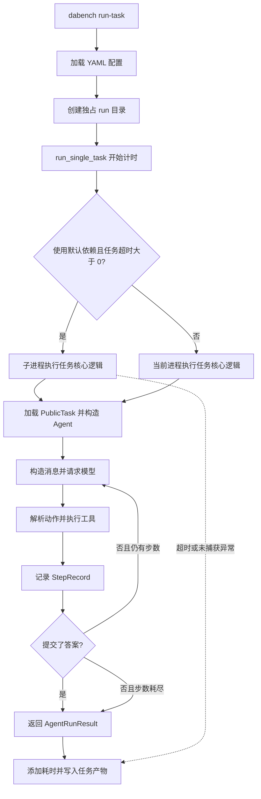

# 改造前基线代码结构（历史快照）

> 梳理日期：2026-09-22。本文以 `src/data_agent_baseline/` 当前实现为准，覆盖模块分工、运行时链路、失败重试和可观测性。`etl_design.md` 与 `react.md` 是方案设计，不代表已实现能力。

## 1. 项目定位与边界

项目是面向 DABench 的 Python ReAct 基线：从本地任务目录加载问题，通过模型选择工具、读取数据和执行计算，最后提交二维答案表，由运行器写出 CSV 和过程记录。

当前主链路为：**本地任务 → ReAct 循环 → 工具观察 → `answer` 提交 → 运行产物**。尚无独立 ETL 流水线、统一数据仓库、持久化求解程序管理、答案评分器或服务端 API。依赖中虽然包含 DuckDB、pandas、Polars 等数据分析库，但框架自带 SQL 工具使用 SQLite；这些依赖没有自动构成数据加载或 ETL 阶段。

`succeeded` 表示 Agent 提交了结构合法的答案且没有最终失败原因，不表示答案通过标准答案比对或语义正确性检查。

## 2. 目录结构与模块分工

```text
data-agent/
├── pyproject.toml                 # 依赖、dabench 入口及开发工具配置
├── uv.lock                       # 依赖锁文件
├── configs/
│   └── react_baseline.example.yaml
├── src/data_agent_baseline/
│   ├── cli.py                    # 命令行、状态展示、批跑进度
│   ├── config.py                 # 配置模型、YAML 加载和路径解析
│   ├── benchmark/
│   │   ├── schema.py             # 任务、资源和答案的数据对象
│   │   └── dataset.py            # 任务发现、加载、校验和筛选
│   ├── agents/
│   │   ├── model.py              # 模型接口与适配器
│   │   ├── prompt.py             # 系统、问题与观察提示
│   │   ├── runtime.py            # 单步记录、运行状态和最终结果
│   │   └── react.py              # 模型响应解析与 ReAct 循环
│   ├── tools/
│   │   ├── registry.py           # 工具描述、分发和答案提交
│   │   ├── filesystem.py         # 文件发现与内容预览
│   │   ├── sqlite.py             # SQLite 表结构与查询
│   │   └── python_exec.py        # Python 子进程执行与输出捕获
│   └── run/
│       └── runner.py             # 任务编排、并发、超时和产物落盘
├── docs/                         # 本地设计与项目说明
└── artifacts/                    # 运行产物
```

数据目录 `data/public/input/` 需要另外准备。当前检出的项目没有 `tests/` 测试目录，尽管 `pyproject.toml` 配置了 pytest。`.gitignore` 忽略了 `data/`、`docs/`、`tests/` 和多数运行产物，本文默认也是本地文档。

### 2.1 入口与配置

入口在 [cli.py](../src/data_agent_baseline/cli.py)，由 `pyproject.toml` 将 `dabench` 映射到 `data_agent_baseline.cli:main`。

| 命令 | 职责 |
| --- | --- |
| `status` | 展示目录存在状态、任务总量和难度分布 |
| `inspect-task` | 加载指定任务，打印问题与上下文文件清单 |
| `run-task` | 创建运行目录，执行一个任务，展示产物与失败原因 |
| `run-benchmark` | 遍历任务，可用 `--limit` 截取前 N 个，展示批跑进度 |

[config.py](../src/data_agent_baseline/config.py) 使用不可变 dataclass 表达三组配置：

| 配置组 | 字段及代码默认值 | 作用 |
| --- | --- | --- |
| `dataset` | `root_path=data/public/input` | 数据集入口 |
| `agent` | `model=gpt-4.1-mini`、`api_base=https://api.openai.com/v1`、`api_key=""`、`max_steps=16`、`temperature=0.0` | 模型连接和步数预算 |
| `run` | `output_dir=artifacts/runs`、`run_id=None`、`max_workers=4`、`task_timeout_seconds=600` | 输出、并发和任务超时 |

表中是代码默认值；示例 YAML 使用模型连接占位符、`max_workers=8` 和固定示例 `run_id`。配置中的相对数据与输出路径相对于项目根目录解析。API key 从配置读取，代码没有显式读取环境变量作为后备来源。配置加载主要进行基本类型转换，没有统一的范围校验。

### 2.2 数据集与数据契约

[dataset.py](../src/data_agent_baseline/benchmark/dataset.py) 的 `DABenchPublicDataset` 按 `task_<数字>` 发现目录，并按编号排序。每个任务要求：

```text
data/public/input/task_<id>/
├── task.json       # 恰好包含 task_id、difficulty、question
└── context/        # 必须存在的上下文目录
```

加载时检查 JSON 字段集合、任务 ID 与目录名的一致性、上下文目录存在性。`iter_tasks()` 支持按 ID 或难度筛选，但当前配置与 CLI 批跑没有暴露这些筛选项，只有 `--limit`。

[schema.py](../src/data_agent_baseline/benchmark/schema.py) 中的核心对象为：

| 对象 | 职责 |
| --- | --- |
| `TaskRecord` | 保存任务 ID、难度、问题 |
| `TaskAssets` | 保存任务目录和上下文目录 |
| `PublicTask` | 将任务元信息与资源组合，供 Agent 和工具使用 |
| `AnswerTable` | 保存 `columns` 与 `rows`，供 trace 和 CSV 序列化 |

### 2.3 Agent 与模型适配

[model.py](../src/data_agent_baseline/agents/model.py) 定义 `ModelAdapter.complete(messages) -> str`。生产适配器 `OpenAIModelAdapter` 在每次调用时创建 OpenAI 客户端，通过 Chat Completions 请求文本；`ScriptedModelAdapter` 则按顺序返回预置响应，提供离线调试的注入点。

[prompt.py](../src/data_agent_baseline/agents/prompt.py) 将工具描述、JSON 示例、任务问题及历史观察拼成消息。工具调用采用模型文本中的自定义协议，不使用原生 function calling：

```json
{
  "thought": "简短说明下一步",
  "action": "read_csv",
  "action_input": {"path": "table.csv", "max_rows": 20}
}
```

提示要求使用一个 JSON 代码块；[react.py](../src/data_agent_baseline/agents/react.py) 的解析器也接受普通代码块或裸 JSON，并检查 `thought`、`action`、`action_input` 的基本类型。工具 Schema 作为提示文本提供，不存在统一的 JSON Schema 参数校验层，具体处理函数负责取参、转换和校验。

[runtime.py](../src/data_agent_baseline/agents/runtime.py) 分离了三个层次：`StepRecord` 保存一轮过程，`AgentRuntimeState` 保存当前任务的内存状态，`AgentRunResult` 表示任务最终结果。每次 `run()` 都创建新的状态，没有跨任务对话记忆。

### 2.4 工具层

[registry.py](../src/data_agent_baseline/tools/registry.py) 用 `specs` 生成工具提示，用 `handlers` 执行分发。统一返回 `ToolExecutionResult(ok, content, is_terminal, answer)`。

| 工具 | 实现与默认行为 | 边界 |
| --- | --- | --- |
| `list_context` | 遍历目录，默认深度 4，返回路径、类型和大小 | 不读取文件内容；遍历没有复用路径解析器的越界检查 |
| `read_csv` | 默认返回前 20 行，同时返回总数据行数 | 先完整读入 CSV，再截取预览；值为字符串 |
| `read_json` | 完整解析 JSON，格式化后默认截取 4000 字符 | 返回预览文本，截断后不保证仍是完整 JSON |
| `read_doc` | 按文本读取，默认截取 4000 字符 | 无 PDF、Word 专用解析或 OCR |
| `inspect_sqlite_schema` | 查询非系统表的名称及建表 SQL | 不建立跨文件统一 Schema |
| `execute_context_sql` | 只读连接，允许以 `select`、`with`、`pragma` 开头的语句；默认返回至多 200 行 | `limit` 控制返回行数，不限制查询计算量，也不是独立 SQL 超时 |
| `execute_python` | 在子进程执行任意 Python，工作目录为任务 `context/`，固定超时 30 秒 | 每次执行使用新命名空间；文件修改可能跨调用保留 |
| `answer` | 验证答案表并返回终止信号 | 只做结构校验，不检查事实、计算依据或标准答案 |

`answer` 要求列名是非空字符串列表，每行必须为列表且长度与列数一致。允许空行集合、重复列名和空字符串列名，不校验单元格业务类型，也不强制答案来自 Python 或 SQL 的输出。提示要求先探查数据，但运行时没有强制执行此前置条件。

文件读取和 SQLite 入口通过 `resolve_context_path()` 解析真实路径，检查其位于 `context/` 内且存在。Python 工具只切换工作目录，保留完整 builtins，没有实现目录写入隔离、网络隔离或操作系统沙箱；不能把提示词中的访问约束理解为所有工具都有强制权限限制。

## 3. 运行时链路

### 3.1 单任务端到端



关键函数集中在 [runner.py](../src/data_agent_baseline/run/runner.py)：

1. `create_run_output_dir()` 创建 `<output_dir>/<run_id>`。默认 ID 是精确到秒的 UTC 时间戳；指定 ID 必须是单个目录名，目录已存在直接失败，因此不支持在同一运行目录上续跑。
2. `run_single_task()` 选择超时包装或直接执行路径。
3. `_run_single_task_core()` 加载任务，构造模型、工具注册表和 `ReActAgent`，调用 `agent.run(task)`。
4. 每轮重建完整消息：系统提示 → 问题 → 所有历史模型原始响应与工具观察。没有历史摘要、上下文压缩或 token 预算管理。
5. 每轮只解析一个动作并同步执行一个工具。成功的 `answer` 结束循环；其他观察进入下一轮，直至步数耗尽。
6. 返回结果后添加 `e2e_elapsed_seconds`，再写入 `trace.json`；存在答案对象时写入 `prediction.csv`。

文件目录不会自动预载入模型上下文，Agent 需要主动调用工具探查。任务难度用于元信息与统计，不进入当前问题提示。

### 3.2 批量运行与并发

`run_benchmark()` 先创建运行目录，加载并校验任务列表，再应用 `limit`。因此即使只跑前 N 个，也会先加载全部任务，后续任务的元数据错误仍可能提前中断批跑。

| 路径 | 调度和实例复用 | 任务级超时 |
| --- | --- | --- |
| 默认 `run-task` | 单次任务调用；超时开启时创建任务子进程 | 生效 |
| `run-benchmark` 且 `max_workers > 1` | 线程池调度；每个任务自行构建模型和工具；超时开启时各线程再创建任务子进程 | 生效 |
| `run-benchmark` 且 `max_workers == 1` | 顺序执行，复用模型适配器与工具注册表 | **绕过超时包装** |
| Python API 注入 `model` 或 `tools` | 批跑强制单 worker；直接调用任务核心逻辑 | **绕过超时包装** |

串行批跑内部将共享 `model/tools` 传给 `run_single_task()`，因此即使配置了正数超时，也进入直接执行分支。这是当前代码行为。复用适配器不代表复用 OpenAI 客户端，后者仍在每次 `complete()` 内创建。

并发分支按完成顺序触发 `progress_callback`，但通过原始索引收集结果，使返回列表和 `summary.json` 的任务顺序与选取顺序一致。所有任务正常返回并完成产物写入后，才生成批次汇总。

### 3.3 Python 执行子链路

`execute_python_code()` 创建临时 stdout/stderr 文件与进程间队列，启动子进程，切换到上下文目录后通过 `exec()` 执行代码。子进程注入 `context_root`、`Path` 和 builtins；执行状态通过队列传回，输出通过临时文件读取。

输出捕获同时重定向 Python 标准流和文件描述符 1/2。普通执行异常返回 `error` 与 `traceback`；超时返回已经捕获的输出。结果被包装成工具观察，供下一轮模型修正。临时捕获文件随后清理，输出文本通过 trace 保留；没有专门持久化 Python 程序文件的步骤。

## 4. 失败处理、重试与恢复

### 4.1 当前支持的恢复方式

当前主要恢复机制是 **同一 ReAct 尝试中的后续步骤修正**：将解析错误或工具失败反馈给模型，再让模型选择新动作。失败轮次同样消耗 `max_steps`，没有独立的修复预算。

| 失败位置 | 当前处理 | 能否继续及记录情况 |
| --- | --- | --- |
| 响应无法解析、未知工具、参数错误、读取/SQL 异常、答案结构不合法 | `ReActAgent.run()` 捕获 `Exception`，记录 `action="__error__"` 和错误观察 | 下一轮可修正；保留原始响应，但解析出的动作字段被置空或替换 |
| Python 执行异常、超时或未返回结果 | 工具返回 `ok=false` 的观察 | 下一轮可修正；步骤保留 `execute_python` 动作及相应输出 |
| 步数耗尽仍无答案 | 返回 `Agent did not submit an answer within max_steps.` | 当前任务结束，已有步骤保留 |
| 缺少 API key、模型 API 异常、响应缺少文本 | 模型调用位于 ReAct 的 `try` 外，异常向上抛出 | 不进入后续模型修正；是否生成失败产物取决于任务执行路径 |
| 任务子进程内未捕获异常 | 外层捕获 `BaseException`，向父进程返回错误字符串 | 父进程生成失败结果，`steps=[]`，此前步骤丢失 |
| 任务级超时 | 终止任务进程，等待 1 秒，必要时 `kill` | 生成失败结果，`steps=[]`；不自动重跑 |
| 任务进程异常退出或无队列结果 | 根据退出码或缺失结果生成失败原因 | 生成失败结果；不自动重跑 |
| 直接执行路径的未捕获异常 | 向调用者抛出 | 可能没有当前任务 trace，并中断批跑 |
| 配置、任务列表加载、产物写入或完成回调异常 | 没有统一的逐任务兜底 | 可能中断批跑，且不生成 `summary.json` |

批跑中的 `future.result()` 也没有逐任务异常包装。因此并发执行只对被转换为失败结果的情况实现隔离，不保证任意任务异常都不会影响批次。

### 4.2 超时层次及限制

- **任务层**：默认 600 秒，`<= 0` 关闭；只有未注入依赖的路径启用。超时覆盖任务核心逻辑，不覆盖之后的产物写入。
- **Python 工具层**：注册表固定设置 30 秒，不受 YAML 中任务超时值影响。超时后执行 `terminate()` 并无期限 `join()`，没有任务层那样的 `kill` 后备流程。
- **模型请求层**：代码没有显式设置 SDK 的请求超时或 `max_retries`；其内部行为由实际安装的 SDK 决定。项目自身没有模型请求退避、重试次数或错误分类配置。
- **SQL 层**：没有独立的查询截止时间；返回行数上限不能替代计算超时。

任务超时只显式终止直接创建的任务进程，没有递归清理 Python 工具及其派生子进程的实现。两个进程包装均采用先 `join()`、再检查 `Queue.empty()` 并取结果的方式；这里没有独立的消息读取超时和可靠交付协议，大结果传输与队列状态竞态是需进一步验证的边界。

### 4.3 尚未实现的重试能力

当前没有整任务重启、失败任务自动补跑、断点恢复、干净工作目录回滚、ETL 分块重试、缓存复用或最终降级流程。重新执行命令需要新的 `run_id`；这会创建新的产物目录，但不会恢复被 Python 代码修改过的输入文件。

## 5. 可观测性与产物

### 5.1 落盘结构

```text
artifacts/runs/<run_id>/
├── task_<id>/
│   ├── trace.json       # 任务结果返回后写入
│   └── prediction.csv   # 结果中存在答案对象时写入
└── summary.json         # 仅批跑完整结束后生成
```

写入顺序为 trace → prediction，批跑结束后再写 summary。当前使用直接文件写入，没有临时文件原子替换，也没有事务性发布。单任务模式不生成批次汇总。

### 5.2 任务过程记录

| `trace.json` 字段 | 含义 |
| --- | --- |
| `task_id` | 任务标识 |
| `answer` | 最终 `columns/rows`，失败时通常为 `null` |
| `steps` | 步骤数组，每项包含 `step_index`、`thought`、`action`、`action_input`、`raw_response`、`observation`、`ok` |
| `failure_reason` | 最终失败原因字符串，成功时为 `null` |
| `succeeded` | 是否存在答案且没有最终失败原因 |
| `e2e_elapsed_seconds` | 从进入 `run_single_task()` 到拿到结果的耗时，保留三位小数，不含产物写入 |

观察保存工具的完整返回字典，包括文件预览、SQL 结果，以及 Python 的 stdout、stderr 和适用时的 traceback。记录足以查看正常返回任务的动作轨迹，但不保存完整请求消息、系统提示快照、配置快照或模型版本信息。

trace 在任务返回后一次性写入，没有逐步追加或 checkpoint。任务被强制终止，或在外层被转为失败结果时，无法从该 trace 恢复此前的内存步骤。

### 5.3 批次汇总与 CLI 进度

`summary.json` 包含 `run_id`、`task_count`、`succeeded_task_count`、实际 `max_workers` 及任务产物列表。每个任务条目提供任务目录、预测文件路径、trace 路径、成功状态和失败原因。任务耗时需读取各 trace，汇总本身没有延迟分位数、错误分类或准确率。

CLI 使用 Rich 展示完成比例、成功/失败计数、运行/排队数量、任务每分钟吞吐、已用时间、预计剩余时间和最近任务。进度在任务完成回调时更新，不显示任务内部步骤。

`run` 与 `queue` 是根据剩余任务数和 worker 数估算的值，不是对线程或子进程状态的实时采样。批跑结束时的 `last` 使用有序产物列表最后一项，也不一定是实际最后完成的任务。

### 5.4 当前观测缺口

当前没有逐模型请求和逐工具耗时、token/费用统计、SDK 重试次数、结构化错误码、运行配置指纹、输入数据指纹、实时日志事件流、指标服务或分布式追踪。`thought` 是模型按协议返回的文本字段，不应等同于模型内部完整推理过程。

排查时可以按以下顺序查看：

1. 查看 `summary.json` 的失败任务与产物路径；若文件不存在，确认批跑是否提前抛出异常。
2. 查看任务 trace 的 `failure_reason`、`e2e_elapsed_seconds` 和最后几轮 `observation`。
3. 对 `__error__` 检查原始模型响应和解析/工具错误；对 `execute_python` 检查 `stderr`、`error` 与 `traceback`。
4. 对 `steps=[]` 的超时或未捕获异常，结合终端输出定位；当前产物无法还原已丢失的中间步骤。
5. 对运行成功但答案不正确的任务，沿观察与答案表核对数据和计算依据；项目没有内置评分结果可供直接判断。

## 6. 与现有设计文档的对应关系

| 设计方向 | 当前落地情况 |
| --- | --- |
| 文档 ETL、Schema 建立、实体分组与抽取、质量修复 | 未实现；当前只有文本预览和任意 Python 执行入口 |
| 多数据源统一查询语义 | 未实现；CSV/JSON/文本工具与 SQLite 工具各自工作 |
| ReAct 探查—行动—观察 | 已实现同步单动作循环和历史观察回放 |
| 持久化求解程序、专用编辑工具、程序生成正式答案 | 未实现；当前由模型调用 `answer` 直接提交表格 |
| 完整尝试重启、干净恢复、最终降级 | 未实现；只有轮内错误反馈和超时失败 |
| 输出结构检查 | 已有基础列/行结构校验，无语义与业务质量校验 |
| 过程审计与资源观测 | 已有任务 trace、批次 summary、CLI 进度；缺少增量日志及细粒度指标 |

后续改造的主要接入点是：在任务核心逻辑前增加数据准备阶段，在 `ToolRegistry` 中增加专用工具，在 `ReActAgent` 中扩展循环与上下文管理，在 `runner.py` 中统一超时和重试语义，并通过 `runtime.py` 扩展过程记录。以上是模块接入位置说明，不代表已有这些实现。
