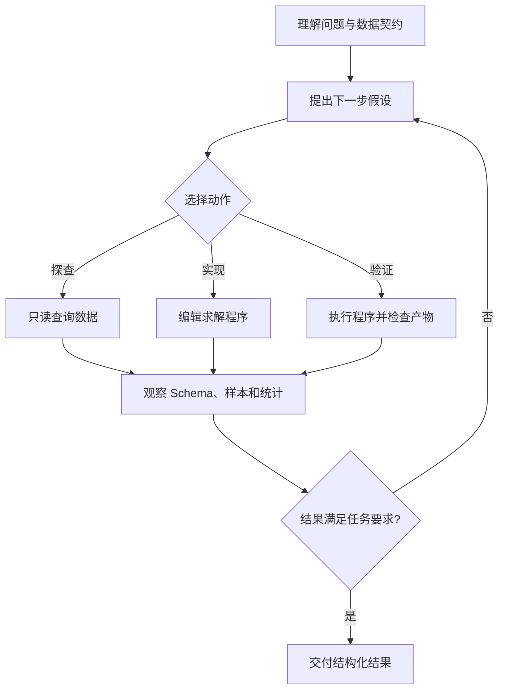
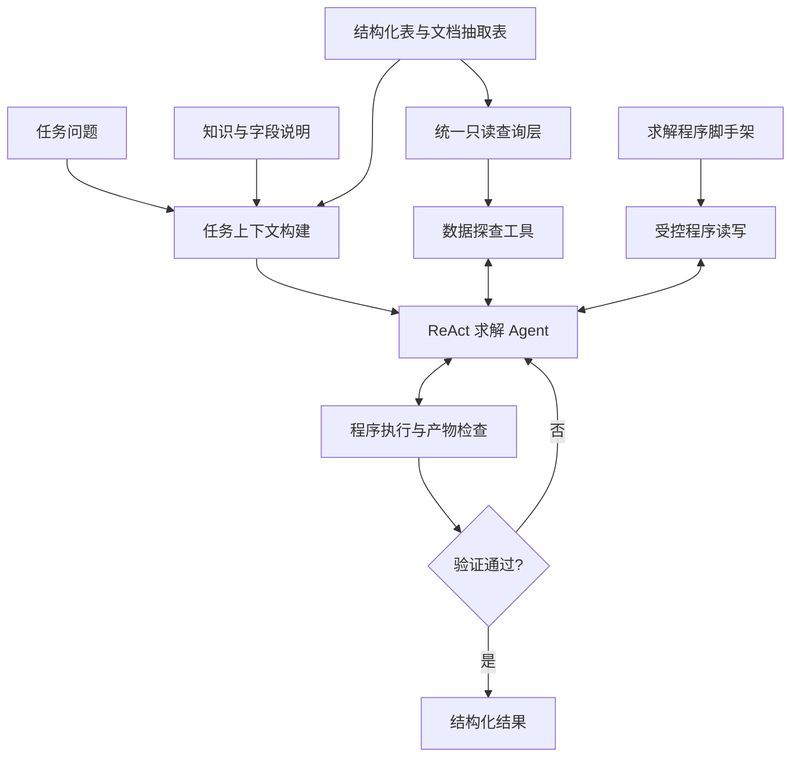

# 文本数据分析 ReAct 方案设计

## 1. 文档目的

本文定义一套面向文本型数据分析任务的 ReAct 求解方案。系统接收自然语言问题、数据说明、结构化数据和由文本文档转换得到的结构化数据，通过多轮“推理—行动—观察”完成数据探查、查询实现、结果校验和交付。

本文只讨论文本链路，不包含视频、音频、图像理解、语音识别或多模态输入处理。方案不依赖特定代码仓库、Agent 框架、模型供应商或数据库产品。

## 2. 设计目标

系统需要满足以下目标：

- 根据自然语言问题理解答案粒度、筛选口径和输出形态。
- 在多种结构化数据源中定位必要的表、字段和关联关系。
- 通过真实查询验证假设，而不是依赖字段名称或领域常识猜测。
- 将最终分析过程固化为可重复执行的程序，而不是只返回模型生成的答案。
- 在受控工具和目录权限内完成数据探查、代码修改和执行。
- 对执行错误、空产物和格式问题进行闭环修正。
- 保留对话、工具调用、执行结果和资源消耗，支持审计与复盘。

系统最终交付结构化结果文件。自然语言解释和 Agent 的最终回复不是正式数据产物。

## 3. ReAct 核心思想

ReAct 循环由三个基本动作组成：

1. **Reason**：分析当前已知信息，形成下一步最小可验证假设。
2. **Act**：调用受控工具查看数据、修改求解逻辑或执行程序。
3. **Observe**：读取工具返回的 Schema、样本、错误或结果摘要，据此更新判断。



循环的重点不是增加思考轮数，而是让每个关键判断都能落到数据证据或执行结果上。Agent 不应在一次长推理中完成所有猜测，而应不断缩小不确定性。

## 4. 核心设计原则

### 4.1 探查与执行使用同一数据语义

探查工具和最终求解程序应使用同一查询引擎、表注册规则、字段名规范化逻辑和 SQL 方言。Agent 在探查阶段验证通过的查询，应能直接迁移到最终程序中执行。

如果探查和执行分别使用不同引擎或不同数据加载方式，容易出现类型转换、空值规则、标识符引用和函数语义不一致，使“探查正确、交付失败”。

### 4.2 数据结论必须通过查询验证

以下判断不能只依赖列名或样例，需要使用真实数据验证：

- 表与字段是否确实承载目标指标。
- 关联键是一对一、一对多还是多对多。
- 实体是否重复，答案应按记录还是按实体去重。
- 数值列的单位和数量级是否一致。
- 日期、分类和状态字段的真实取值形式。
- 过滤条件命中多少行，是否符合题意。
- 空值是否代表缺失记录、无效记录或合法观测。

### 4.3 最终答案必须程序化生成

Agent 的任务是构造可执行的分析程序。结果必须由程序读取数据、执行查询、完成必要转换并写出，不能由模型直接手写结果文件中的值。

这样可以保证：

- 同一输入可重复执行。
- 查询逻辑可以审计。
- 执行错误能够被工具捕获。
- 最终结果可以进行结构化自检。

### 4.4 工具职责单一

系统将能力拆成四类工具：

| 工具 | 职责 | 约束 |
| --- | --- | --- |
| 数据探查 | 查看表、Schema、样本并执行只读查询 | 禁止写数据和修改数据源 |
| 程序读取 | 查看当前求解程序 | 只能读取指定程序文件 |
| 程序编辑 | 修改求解逻辑 | 只能编辑指定程序文件，并进行并发修改保护 |
| 程序执行 | 运行求解程序并检查结果 | 不能用于任意命令执行或临时数据探查 |

Agent 不获得通用 Shell、任意文件写入或直接读取原始数据文件的能力。收窄工具面可以减少路径错误、绕开统一查询层和误修改输入数据等问题。

### 4.5 上下文压缩不能改变数据可达性

一个任务可能包含大量无关表和文档。系统可以先做相关性判断，只在初始提示中展开可能相关的数据源，折叠其余来源的详细描述。

这种筛选只能减少提示噪声，不能从底层查询环境移除数据。即使相关性判断错误，Agent 仍可通过表清单和 Schema 探查找回被折叠的数据源。

### 4.6 失败后重新建立干净起点

一次求解尝试可能把程序改成语法错误、半成品或错误逻辑。新的完整尝试应从初始脚手架重新开始，并清除上一次残留产物，避免把旧结果误判为本次成功。

## 5. 总体架构



系统分为准备层、交互求解层和交付层：

- **准备层**负责隔离任务目录、登记数据源、准备文本文档抽取结果、构造上下文和生成求解程序脚手架。
- **交互求解层**由 Agent 使用专用工具执行 ReAct 循环。
- **交付层**验证本次运行确实生成了有效结果，再将其复制到正式输出位置。

## 6. 文本输入与数据准备

### 6.1 输入组成

文本链路的输入包括：

- 自然语言问题。
- 字段定义、实体关系、单位、编码映射和业务约束。
- CSV、JSON、关系数据库等结构化数据。
- Markdown、纯文本和可提取文本的 PDF 等非结构化文档。

非结构化文档应在主求解前通过独立 ETL 流程转换为查询表。ReAct Agent 主要消费转换后的表和抽取说明；文档结构化的具体设计由 ETL 方案负责。

### 6.2 任务隔离

每个任务在独立工作空间中运行：

- 输入和上下文只读。
- 求解程序、中间文件和最终结果只能写入工作目录。
- 不同任务的日志、产物和运行状态相互隔离。
- 并发执行时，每个任务维护独立的轮次和资源统计。

任务开始时复制或创建隔离视图，防止求解过程污染原始输入。

### 6.3 数据源统一注册

准备层将不同格式的数据源注册为统一的可查询表，并提供稳定的规范表名与必要别名。统一层应处理：

- 多文件、多数据库中的重名表。
- 包含空格、括号、中文或特殊字符的表名和字段名。
- JSON 记录结构到关系表的转换。
- 不同来源的类型推断与空值表达。
- 探查和最终执行之间一致的命名规则。

系统应允许先列出所有表，再按需查看单表 Schema 和少量样本，避免一次性将全量数据描述注入上下文。

## 7. 上下文构建与相关性控制

### 7.1 问题拆解

进入 ReAct 循环前，系统需要引导 Agent 明确：

- 最终要输出哪些列。
- 答案行代表实体、事件、关系、观测还是聚合结果。
- 筛选、分组、排序、时间和单位口径来自哪里。
- 是否需要辅助表完成名称、代码和内部主键映射。

相关性判断也应基于这份拆解。某张表即使不含筛选指标，只要提供目标输出列或不可替代的关联桥梁，就属于必要数据源。

### 7.2 数据源相关性判断

系统可使用轻量语义判断对数据源进行分类：

- 直接包含目标指标或输出字段。
- 提供实体映射或关联桥梁。
- 只与业务领域相关，但对当前问题没有实际用途。

边界场景采用召回优先策略：漏掉必要来源的代价高于多保留一段描述。相关性判断失败或超时时，默认保留全部候选来源。

### 7.3 软折叠

被判断为无关的结构化表只折叠 Schema 和样本说明，仍保留在查询层。Agent 若在求解时发现字段缺失，可以重新列举全部表并检查被折叠来源。

文本原文的预处理成本较高时，可以只转换相关文档；该判断必须采用召回优先和失败时全量回退，避免因预筛错误永久丢失信息。

## 8. 求解程序脚手架

系统在 Agent 启动前生成一个最小可执行脚手架，预先固定：

- 输入和输出位置。
- 统一数据源运行时的初始化。
- 执行 SQL 并返回表格结果的接口。
- 结果文件的序列化方式。
- Agent 可修改的查询区域。

Agent 只补充分析逻辑，不重新实现数据加载、路径解析和保存流程。脚手架既降低了低级错误，也为重试提供可恢复的干净基线。

求解程序中应以简短注释记录关键口径决策：目标列、来源表、关联键、过滤条件、聚合粒度、空值策略、去重策略及排序规则。注释用于审计，不代替实际查询验证。

## 9. ReAct 求解流程

### 9.1 第一步：建立数据地图

Agent 首先查看表清单，了解每张表的来源、行数和字段。然后只对候选表查看 Schema 和少量样本。

这一阶段的目标是建立“问题概念 → 数据表 → 字段”的映射，而不是立即编写最终查询。

### 9.2 第二步：验证语义和基数

Agent 使用只读查询验证关键假设，例如：

```sql
SELECT COUNT(*) AS rows,
       COUNT(DISTINCT entity_id) AS entities
FROM candidate_table;
```

还应检查：

- 目标字段的非空率、不同值数量和取值范围。
- 条件边界使用严格比较还是包含边界。
- 关联前后行数是否异常膨胀。
- 多个候选字段中哪个与业务定义一致。
- 查询结果的预期行数和列数。

### 9.3 第三步：实现最小完整查询

Agent 读取脚手架，只修改指定查询区域。最终分析优先使用 SQL 完成过滤、关联、聚合、去重和投影；只有 SQL 不适合表达的轻量结果转换才放在表格处理层完成。

实现时只输出问题明确要求的列。辅助字段可以用于计算，但不应自动进入最终结果。

### 9.4 第四步：执行并观察

执行工具运行求解程序，并返回三类状态：

| 状态 | 含义 | 下一步 |
| --- | --- | --- |
| 失败 | 程序异常退出 | 根据压缩后的错误定位并修复程序 |
| 无产物 | 程序运行完成，但查询或结果仍未实现 | 补全分析逻辑并再次执行 |
| 成功 | 结果文件已生成 | 检查结构和语义是否符合任务 |

成功状态还应返回：

- 行数和列数。
- 列名。
- 各列非空数量。
- 少量结果样本。
- 执行耗时。

### 9.5 第五步：结果自检

Agent 根据问题语义检查：

- 输出列是否过多或缺失。
- 行数是否与此前探查结果一致。
- 空值是否被错误过滤或错误保留。
- 关联是否产生重复行。
- 极值和排名是否遗漏并列结果。
- 数值是否被转换成带单位的字符串。
- 聚合粒度是否与答案粒度一致。

若不满足要求，Agent 回到探查或编辑步骤继续迭代。

## 10. 答案粒度与 SQL 语义

结果错误经常不是 SQL 语法错误，而是答案粒度判断错误。系统应明确区分三类任务：

### 10.1 原始记录或指标列举

当问题要求展示某列的全部观测值或原始记录时，应保留原始行集、重复值和具有业务意义的空值。除非题目明确要求，否则不自动排序、去重或限制行数。

### 10.2 实体名单

当问题询问“哪些实体满足条件”，目标列是名称、代码或 ID 等实体标识时，答案通常是实体集合。底层表中同一实体存在多条事件或观测时，应按目标实体粒度去重。

### 10.3 聚合、排名和关系结果

计数、求和、平均值、比例、分组和排名按题目指定粒度执行。实体之间的关系实例不能仅按关系一侧去重。极值题应考虑并列，只有题目明确要求唯一一条时才能任意选取单行。

### 10.4 空值原则

空值不是默认噪声。系统需要根据任务类型判断：

- 原始观测列举中，空值可能属于答案行集的一部分。
- 聚合计算中，空值通常按对应函数的语义处理。
- 分类判断中，空值不能被隐式归入正常或异常类别。
- 关联产生的空值需要区分“无匹配”与“来源字段本身为空”。

## 11. 工具与执行安全

### 11.1 只读数据探查

探查工具只允许查询、描述和解释类语句，拒绝创建、修改、删除、导入和导出操作。查询结果需设置行数上限和单元格长度上限，避免大结果挤占上下文。

### 11.2 定点文件编辑

程序编辑工具只接受目标文件中的稳定位置标识。每次编辑基于最近一次读取结果；文件发生变化后，旧位置标识失效，从而防止并发或多轮修改覆盖错误区域。

编辑提交前应进行语法检查。失败时返回错误行附近的上下文，并保持磁盘上的原文件不变。

### 11.3 受控执行

执行工具只运行约定的求解程序，设置超时并捕获标准输出、错误输出和退出码。错误信息需要压缩冗长堆栈，同时保留用户代码位置、异常类型和关键数据库提示。

运行工具不能替代数据探查工具。查询验证应在只读环境完成，避免靠反复执行最终程序进行盲目试错。

## 12. 重试与失败恢复

### 12.1 ReAct 内部修正

单次尝试中，Agent 可以多次探查、编辑和运行。模型请求数、查询时间和程序执行时间都需要设置上限。

### 12.2 完整尝试重启

若单次尝试因请求上限、模型异常或不可恢复的程序状态失败，系统启动新的完整尝试：

1. 恢复初始脚手架。
2. 删除上一尝试的结果文件。
3. 保留输入数据和只读探查能力。
4. 使用相同任务上下文重新执行 ReAct 循环。

只有 Agent 本轮正常结束且本轮生成了新结果文件，才算成功。旧产物不能作为成功依据。

### 12.3 最终降级

所有智能尝试失败后，可以执行当前或初始求解程序作为最后降级，但降级产物仍需满足最基本的可读性和结构校验。系统必须在状态中标明降级来源，不能将其与正常求解成功混淆。

## 13. 上下文与资源管理

长时间 ReAct 会累积 Schema、样本、查询结果和错误信息。系统应自动压缩早期对话，同时保留：

- 用户问题和数据契约。
- 已确认的表、字段和业务口径。
- 当前求解程序状态。
- 最近一次失败原因。
- 仍待验证的假设。

工具输出应按需返回，避免全表数据、完整长文本和重复 Schema 长期驻留上下文。

多个任务可以并发执行，但每个任务应拥有独立的 Agent、模型请求计数、工作目录、日志和超时状态。并发上限需结合模型吞吐、数据库内存和本地执行资源设置。

## 14. 可观测性

每个任务至少记录：

| 维度 | 指标 |
| --- | --- |
| ReAct | 模型请求轮数、每轮工具名称、每轮耗时 |
| Token | 输入、输出、缓存读取和总 token 数 |
| 工具 | 探查次数、编辑次数、执行次数、错误次数 |
| 任务 | 各准备阶段与求解阶段耗时 |
| 尝试 | 尝试次数、失败原因、是否从干净脚手架恢复 |
| 产物 | 是否生成、行列数、非空统计、交付状态 |

完整消息历史应按尝试保存。日志既用于排查模型决策，也用于区分提示问题、数据问题、查询问题和工具问题。

## 15. 验收标准

方案实现至少满足以下验收要求：

1. **探查执行一致**：探查环境验证通过的查询能在最终程序中按相同语义执行。
2. **程序化交付**：结果由可执行程序生成，不由模型直接编造数据行。
3. **权限隔离**：Agent 不能修改输入数据，也不能在工作目录外写文件。
4. **工具收敛**：数据探查、程序编辑和程序执行通过各自专用工具完成。
5. **软过滤可恢复**：提示中被折叠的数据源仍可被 Agent 查询和找回。
6. **粒度正确**：原始记录、实体集合、关系实例和聚合结果采用各自正确的去重与空值策略。
7. **结果自检**：成功执行后自动报告行列数、列名、非空统计和样本。
8. **重试无污染**：新尝试不继承旧程序错误和旧结果文件。
9. **失败可诊断**：模型异常、SQL 错误、程序错误、无产物和超时具有不同状态。
10. **过程可审计**：能够还原每轮推理所依据的工具观察及最终程序逻辑。

## 16. 方案边界

本方案假设文本资料已经能够被读取，非结构化文档所需字段能够通过独立 ETL 转换为查询表。文档抽取质量不足时，ReAct Agent 可以通过统计发现异常，但不能保证从缺失或错误的抽取结果中恢复原始事实。

ReAct 能提高数据分析过程的可验证性，但不能消除问题本身的歧义。题目没有说明时间范围、聚合粒度或并列规则时，系统应采用可解释的最小假设，并在运行记录中保留该决策。

当任务需要外部实时信息、写回业务系统、访问网络服务或处理多模态内容时，需要额外的数据源和权限设计，不属于本文范围。
